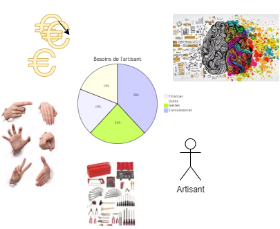
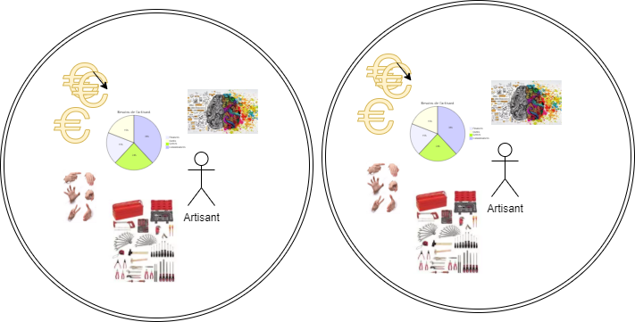
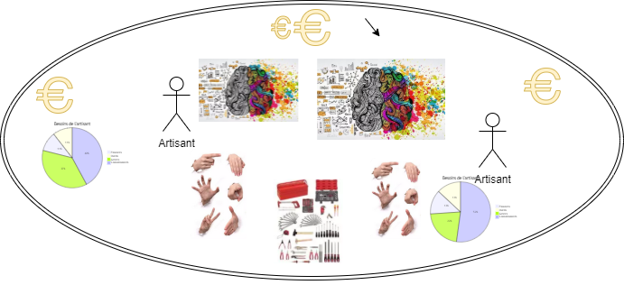
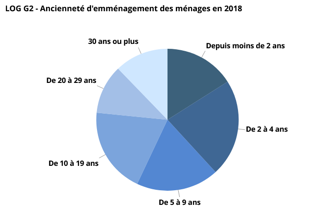
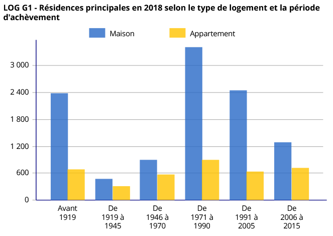
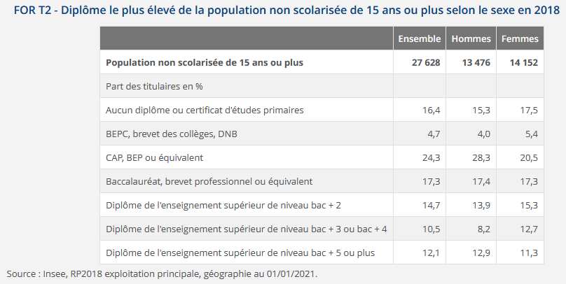
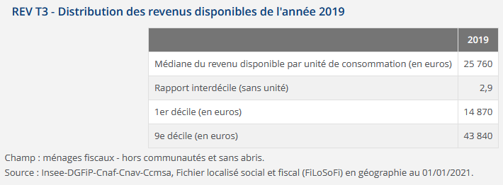

# Les Arts Disant du bois

Association d'artisanat partagé

## Introduction

### La démarche artisanale collective
> L’artisanat est la transformation de produits ou la mise en œuvre de services grâce à un savoir-faire particulier et hors contexte industriel de masse : l'artisan assure en général tous les stades de sa transformation, de réparation ou de prestation de services, et leur commercialisation.  

 https://fr.wikipedia.org/wiki/Artisanat 

Dans une sociétée dominée par les relations de consommation, la pratique artisanale présente de nombreux intérêts économiques et écologiques en favorisant une approche de production orientée vers la **qualité** et la **recherche de valeur**.

Elle peut revêtir toute une gamme de mise en oeuvre, pouvant aller de la pratique récréative, individuelle ou partagée auprès d'un cercle d'amis ; jusqu'à un niveau d'exigence professionnel et/ou artistique.

Quel que soit le niveau du pratiquant, chacune de ces formes de mise en oeuvre nécessite une mobilisation de moyens financiers, d'outils, de gestes techniques, et de connaissances.  
  

Dans un environnement individualiste, chacun de ces besoins vont tronver réponse de manière cloisonnée, en ayant recours à des services ; en se fournissant auprès des enseignes de bricolage, en se formant sur des tutoriels internet ou des ouvrages litéraires, parfois des écoles.

Cette organisation individualiste provoque une répétition des mêmes enjeux de mobilisation auprès de chaque acteur. Or si les quantités peuvent être sommées (moyens financiers, outillages), la qualité des gestes et des connaissances ne peut suivre une telle arithmétique.  
  

Ce phénomène abouti à de nombreux déséquilibre :
- Les mêmes outils se trouvent répétés dans autant d'ateliers, ils seront sous-utilisés, parfoit mal entretenu.
- Les ressources financières de nombreux acteurs sont engagées, limitant leurs capacités d'investissement.
- Les connaissances et retours d'expériences sont peu ou mal partagées
- Les gestes mal acquis peuvent présenter des défauts, des risques de sécurité, ou simplement se perdre faute de transmission.

En revanche, en adoptant une démarche artisanale communautaire, nous pouvons envisager d'autres formes de développements de la pratique artisanale.
  

- Les outils partagés sont mieux valorisés, et peuvent bénéficier d'entretients de qualité.
- Les ressources financières sont optimisées
- Les connaissances partagées s'enrichissent des échanges
- Les gestes peuvent être discutés, affinés

Ce simple constat établit la base de la démarche proposée par Les Arts Disant :

Faire progresser chacun dans une démarche *artisanale et collective* ; en favorisant une approche basée sur le partage des connaissances, des ressources matérielles et du dialogue des gestes.

### L'artisanat du bois

Le bois est un matériaux naturel, renouvelable, et produit en importantes quantités et qualités sur le territoire Français.

Il authorise de grandes variétés :
- de formes et d'usages, allant du fonctionnel le plus simple jusqu'à l'artistique le plus raffiné
- de mise en oeuvre, allant de la scie à main jusqu'à la commande numérique
- de technicités, allant de la forme brute jusqu'aux assemblages les plus subtils

Il constitue à ce titre une ressource idéale pour explorer **sa** pratique artisanale ; ouvrant une large gamme de possibilités, il offre un terrain de jeu immense où chacun peut trouver un espace où se réaliser.

Au delà du matériau lui-même, les projets d'artisanat du bois peuvent concerner par exemple :
- le dessin de projets ; artistique ou technique (épures)
- les études de structures (mécanique)
- la recherche de jeux de matières, ou de couleurs
- la conception ou l'utilisation d'outils informatiques (conception numérique, impression 3D, etc.)

Il s'agit ainsi d'une pratique ouverte vers de larges panels d'activités, et qui permettent ainsi, soit de bénéficier d'apports très variés (informaticien, plasticien, etc.), soit d'ouvrir vers des sujets qui peuvent interesser divers publics.

Le travail du bois permet de mobiliser un très large spectre de points d'intérêts, et ainsi il constitue un support de choix pour mobiliser des dynamiques collectives et participatives.

### Ecologie et développement durable

Le principe de partage des ressources matérielles (petit outillage, machines, locaux), constitue un mode de fonctionnement de base orienté vers une gestion plus durable et raisonnée des ressources.

Mais au delà de cela, de part son origine purement naturelle, locale, et renouvelable, le bois constitue un support de sensibilisation idéal à l'écologie et au développement durable.

Il permet ainsi de développer plusieurs axes de sensibilisation à une citoyenneté écologique
- En identifiant et valorisant les filières locales, courtes.
- En apprenant les gestes et les techniques qui optimisent la ressource disponible.
- En redécouvrant des pratiques permettant d'éviter la consommation de certains produits de synthèse.
etc.

Un tel atelier peut également participer à la collectivité, par exemple
- En fournissant des composteurs, ou de petits mobiliers urbains
- En devenant un support facilitateur de rénovation
- En proposant des activités ouvertes aux jeunes publics

## Le contexte du bassin Arbreslois et de son environnement proche

### La population 
La population de l'Arbresle, et plus globalement de la CCPA, d'un renouvellement régulier et significatif  
  
https://www.insee.fr/fr/statistiques/2011101?geo=COM-69010#graphique-LOG_G2
*celui de la CCPA est similaire https://www.insee.fr/fr/statistiques/2011101?geo=EPCI-246900625#graphique-LOG_G2)

Parmis ces populations entrantes, une certaine partie peut être en recherche d'activités communautaires, ludiques, fédératives.

Par ailleurs, le territoire de la CCPA est composé d'un important patrimoine de maisons, avec une part significtif de batiments anciens, et une autre partie héritée des années 70-90.  
  
https://www.insee.fr/fr/statistiques/2011101?geo=EPCI-246900625#graphique-LOG_G1

Les niveaux de diplômes sont diversifiés  
  
avec une relativement grande disparité de revenus  
  

### La filière bois

En France, la filière bois est généralement très segmentée entre producteurs (forestiers, scieries) et consommateurs (menuisiers, artisants du BTP), avec une chaine logistique de distribution fortement internationnalisée.

Les producteurs de bois sont organisés localement en associations
- Fibois : 
  - Fibois69 : https://www.fibois69.org/infos/13_strategie-foret-bois-du-beaujolais
  - Fibois42 : https://www.fibois42.org/
  - Fibois01 : https://www.fibois01.org/
  - Fibois Aura : https://www.fibois-aura.org/
- Coforet : https://www.coforet.com/
- 

Du côté des artisants, l'essentiel repose sur des entreprises individuelles peu fédérées
On notera la présence des associations suivantes dans un secteur géographique relativement proche, et avec lesquelles des partenariats pourraient être bénéfiques.
- Lyon 
  - Cobois : http://www.cobois.org
- Amplepuis :
  - Atelier Tiers Lieu : https://www.ateliertierslieu.org/ 
- Grenoble
  - Les Copeaux d'abord : http://lescopeauxdabord.asso.fr/
- Bourg en Bresse
  - Atelien : https://www.facebook.com/latelien01

### Interprétation

Le contexte socio-culturel diversifié de la CCPA peut être considéré comme un lieu de brassage ethnique, socio-culturel et générationnel, qui constitue en soit une importante source de richesse.
En favorisant les rencontres et d'échanges, on génère autant d'occasion d'améliorer la qualité de vie de chacun.

Le bricolage est à ce titre un terrain propice à la rencontre, à l'échange et à l'entraide.
Abordé dans un contexte de bienveillance, d'ouverture et de respect, il participe à une citoyenneté participative et fédératrice où chacun peut s'illustrer ; quel que soit sont âge, son origine, son milieu socio-culturel.
Par un conseil, un prêt de matériel, un coup de pouce, ou une simple écoute, il est possible d'apporter son aide, et contribuer à une richesse préciseuse.

Dans ce cadre, un atelier partagé peut jouer un rôle majeur en se positionnant sur une 

## Les phases de développement

La pratique artisanale ne peut se passer d'un lieu adapté à une pratique efficace et sécurisée.
Dans un contexte foncier en tension l'obtention d'un tel local nécessite un investissement important qui peut difficilement être relevé par un collectif naissant.

Dans une première phase, on peut envisager que l'association ne recherche pas de local mais investisse dans un 'coeur collaboratif' orienté vers le partage.
Le plus immédiat concerne les outils, les ressources documentaires, les bonnes adresses, etc.
Selon les choix collectifs qui pourront être réalisés, des ressources numériques pourraient être mises en oeuvre (site internet, et autres solutions adhoc).

Afin de consolider les services proposés par l'association, il est possible d'envisager la recherche d'une assurance pour le pret de matériel, et éventuellement un rapprochement avec les RERS ( https://www.rers.fr/index.php?lang=fr-fr ) pour structurer une méthode de partage.

Au bout de quelques mois, et si le réseau se développe, une seconde phase pourrait émerger avec l'obtention d'un local (ou plusieurs locaux) dédié(s).
